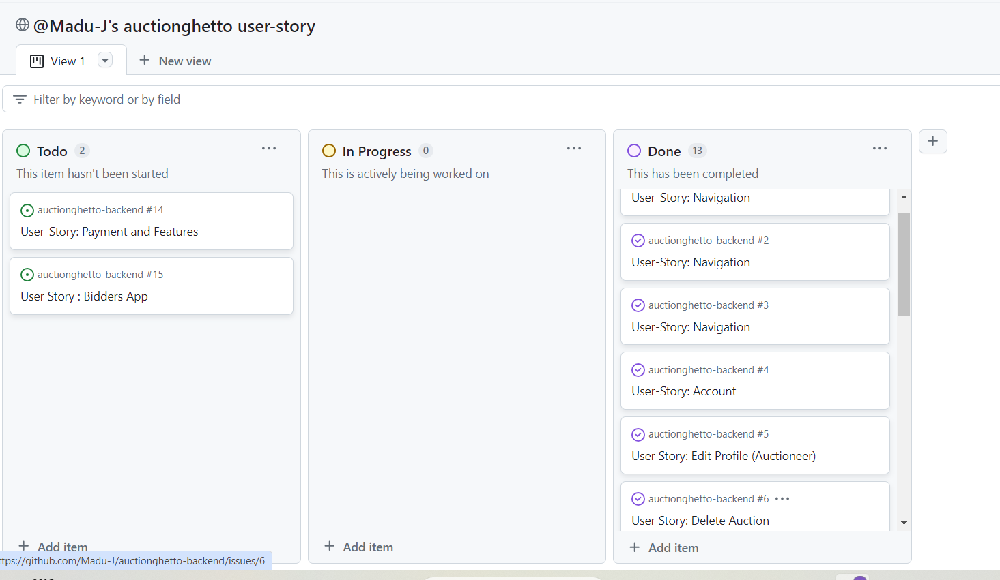

<h1 style="font-size: 45px; text-align: center; color: blue;">Auctiongetto API</h1>

 
  Welcome to Auctionghetto server ! In Auctionghetto platform we priotize our customer's interest. Auctionghetto is built on a powerful toolkit using Django REST framework. This Auctionghetto backend is smoothly interacts with frontend side of Auctionghetto Application Programming Interfaces, when the API sends a request to the server, then the server sends a response back to the clients.
  
  The mode of communication between these two APIs, the backend and the frontend which are tools responsible for connecting software or systems, enabling them to interact with each other simultaneously.

  Following features are available in our site In Auctionghetto we offer a user-friendly interface that allows sellers to effortlessly create captivating listings. Our intuitive posting system ensures that sellers can showcase their auctions with compelling descriptions and high-quality images.

 

#### To view Auctionghetto-live app :
- Click [here](https://auctionghetto-api-17774afbeb21.herokuapp.com/)

 
#### Follow this link below to view the Frontend repository of this project :
- [Auctionghetto Frontend](https://github.com/Madu-J/auctionghetto-frontend/blob/main/README.md)

 

## Table of Contents

  + [User Experience (UX)](#user-experience-ux)

   - [User Stories](#user-stories)

   - [Project Administration](#project_administration)

   - [Design](#design)

 + [Feature](#feature)
      - [Future Features](#future-features)
      - [Testing](#testing)
      - [Bugs](#bugs)
      - [Fixed Bugs](#fixed-bugs)
      - [Remaining Bugs](#remaining-bugs)
 - [Technologies Used](#technologies-used)
      - [Languages and Frameworks Used](#languages-and-frameworks-used)
      - [Python Modules Used](#python-modules-used)
      - [Packages Used](#packages-used)
      - [Programs and Tools Used](#programs-and-tools-used)
 - [Deployment](#deployment)
     - [Deploying to GitHub](#deploying-to-github)
     - [Deploying with Heroku](#deploying-with-heroku)
 - [Credits](#credits)
      - [Credit](#credit)
      - [Media](#media)
    
 

# User Experience (UX)

 - Welcome to Auctionghetto, Auctionghetto is an auction platform where potential user sample and sale their products. Our aim is to provide a community friendly platform for both buyers and salers looking to buy or sell their items.

 # Following features are available in our site

 - In Auctionghetto we offer a user-friendly interface that allows sellers to effortlessly create captivating listings. Our intuitive posting system ensures that sellers can showcase their auctions with compelling descriptions and high-quality images. 

 - You can personalize your choice product as a registered user, you can conveniently bookmark your choice product for a revisit. 
  This feature allows you make an informed decision after you might have compared several other items before buying.

 

# User Stories 

 * USER-STORY: Navigation
 - As a user, I want to access the navbar on every page, so that I can easily navigate through every section of the website I 
  intend to visit.
  
 - As a user, I want to scroll without pagination so that I can view more items on the site and have a seamless browsing experience.
 
 - As a user, I want to be able to search keywords in the search bar so that I can easily access specific items that I am looking for on Auctionghetto website.
 
 * USER-STORY: Account
 - As an Admin, I want to be able to click on a profile (auctioneer) and find more information about the auctioneer on Auctionghetto website, so that I can be able to assess the detail and make informed decision.

 - As a User, I want to be able to edit my profile (Auctioneer) on Auctionghetto, so that I can update or change information.

 * To view more User Story, the user stories are available in the GitHub repository.

 - 

 #### To see Auctionghetto Github User Stories - Click [User-Stories](https://github.com/users/Madu-J/projects/14/views/1)

 ## Agile methodology

 - During the project development, I embraced an Agile Methodology, leveraging the powerful capabilities of GitHub Projects to create User Stories.

 

# Project Administration

## Administrative Tasks

 - User management
 - Access control and permissions
 - Database backups and maintenance
 - System monitoring and logging

 * Procedures

 * User Management

 - Creating new user accounts
 - Managing user roles and permissions
 - Disabling or deleting user accounts

 * Database Backups

 - Performing regular database backups
 - Storing backups in a secure location
 - Testing the restoration process

 * System Monitoring

 - Monitoring system performance
 - Analyzing logs for errors or issues
 - Responding to system alerts
 - 

 - 

 

# Design

* Project data structure.

 - 

 

# Features

 * Database schedule

 * Auction

 - The "auction_id" column presents is uniquely identifies each auction or product. The "auction_name" column stores the name of auctioneer. The "location" column represents the location of each auction. The "contact_info" column stores the contact information for the auction.

 - 

 * Feeds

 - The feed_id: This column has a unique identifier for each feed post and each with different "feed_id" value, allowing you to uniquely identify and reference every feed post.
 The auction_id: This column stores the auction to identify and associate with each feed post. It represents the auctioneer who is responsible for creating or posting, also allows for multiple feed posts, and the "auction_id" helps establish the relationship between the auction and their respective feed posts.

 - 

 - Users

 - The "user_id" column represents a unique identifier for each user entry. The "username" column stores the username of the user. The "email" column represents the email address associated with the user. The "password" column stores the password (hashed or encrypted) for user authentication. Prodoct column stores the item or product associated to each user.

 - 

 * Bookmarks 

 - The "bookmarks_id" column represents a unique identifier for each saved entry. The "user_id" column corresponds to the user who saved the entry, and the "auction_id" column corresponds to the auction being saved. The "date_created" column represents the date when the entry was saved.

 - 

 * Followers

 - The "Followers" relationship and auctionghetto users in this context points that:
  + Row 1 informs that the user with user_id 2 is following the auctioneer with auction_id 3. This table allows to establish and track the followership relationship between users.
  Row 2 is pointing that the user with user_id 3 is following the auctioneer with auction _id 1.
  As row 3 is pointing that the user with user_id 1 is following the auctioneer with auction_id 2.

 - 

 

## Future Features

 * Payment System: Adding payment feature that will allow users make payment online in a situation where a potential buyer would prefer to pay online via Auctionghetto website.
 
 * Future feature will include bidders app and serializer, this will help enhance user experience, so that auctionghetto user or auctioneer can view the highest bidder.

 

# Technologies Used

 * Python: Python
 - Built-in Packages/Modules
 - pathlib- Used to work with filepaths.
 - os - enables efficient file and directory management.

 * Django: Django
 * Django 3.2.19
 * Django Rest Framework 3.15.1

## Frameworks, Libraries & Programs Used

 * Dj-rest-auth Authentication - dj-rest-auth is a Django Rest Framework (DRF) extension offers API help for handling all authentication related processes to DRF-based projects, such as user registration, login, logout and password reset.

 * Django-allauth - is a Django package that provides a set of views, templates, and helper functions to handle user authentication, registration, and account management.

 * Dj-database-url - This package allows the use of the 'DATABASE_URL' environmental variable in the Django project. It can contain information such as where to search for the database.

 * Cloudinary - This package offers tremendous capabilities for managing your online media. It's functionalities includes storing, manipulating and delivering images and videos 

 * Django-cloudinary-storage - This package extends Django's default file adn storage system. It allows to easily store and retrieve files within Django applications and Cloudinary accounts.

 * Pillow - This package is a fork of the Python Imaging Library (PIL). It is a free and open-source library for manipulating and processing images.

 * Django-filter - Django-filter is a generic, reusable application to alleviate writing some of the more mundane bits of view code. It allows users to filter down a queryset based on a model's fields by displaying them.

 * Django-cors-headers - A Django App that adds Cross-Origin Resource Sharing (CORS) headers to responses. This allows in-browser requests to your Django application from other origins.

 * Djangorestframework-simplejwt - Simple JWT provides a JSON Web Token authentication backend for the Django REST Framework. It aims to provide an out-of-the-box solution for JWT authentication which avoids some of the common pitfalls of the JWT specification.

 * Gunicorn - Gunicorn is a pure-Python HTTP server for WSGI applications. It allows you run multiple Python processes within a single dyno. It provides a perfect balance of performance, flexibility, and configuration simplicity.

 * Psycopg2 - Psycopg2 is the most popular PostgreSQL database adapter for the Python programming language. It allows Django to connect and interact with PostgreSQL databases, enabling retrieve data and storage.

 

## Testing

 * Code underwent validator checks using CI Python Linter - [Link](https://pep8ci.herokuapp.com/).

## Bugs

 * Bugs fixed
 - Image - had issues with images path and config.
 - Bookmarkserializer - a typo error caused malfunction.
 - In settings.py identation error fixed.

 - 

## Remaining Bugs

 * No new bug remaining.. see images below:

 - 
 
 - 

 

# Deployment

 * To deploy the project, follow these steps:

*  Forking the GitHub Repository

* Go to the project repository.
- In the top-right corner of the page, click the "Fork" button.
- This will create a copy of the repository in your own GitHub account.
- Running the project locally

* Alternatively, you can use Gitpod:

* Go to the project repository.
- Click on the "Code" button.
- Choose one of the three options (HTTPS, SSH, or GitHub CLI), and click copy.
- Open your IDE program and launch the terminal.
- Type git clone and paste the copied URL from step 3.
- Press Enter, and the local clone of the project will be created.
- Go to the project repository.
- Click the green button that says "Gitpod" to open the project in Gitpod.

* Deploying with Heroku

- To deploy your project using Heroku, follow the steps below based on the Code Institute tutorial:
- In the Gitpod CLI, run the following command to create the necessary files for Heroku to install project dependencies:
- pip3 freeze --local > requirements.txt

- Note: Make sure to add the requirements.txt file to your .gitignore file to prevent it from being committed.
- Visit Heroku.com and log in. If you don't have an account, you will need to create one.

- Click the "New" dropdown and select "Create New App".
- Enter a unique name for your project. Heroku apps require a unique name, and you may be prompted to change it if it's already taken.

* Heroku Deployment

- In the Heroku dashboard, follow these steps:
- Go to the "Deploy" tab.
- Connect your Heroku account to your GitHub Repository by following these steps:
- Click on the "Connect to GitHub" button.
- Enter the name of your GitHub repository and click on "Search".
- Choose the correct repository for your application and click on "Connect".
- Choose your preferred deployment method: manual or automatic.
- Automatic deployment generates a new application every time you push a change to GitHub.
- Manual deployment requires you to push the "Deploy Branch" button whenever you want a change to be made.
- Once you have chosen your deployment method and clicked "Deploy Branch", Heroku will build your application.
- Finally, you should see the "View" button. Click on it to open your deployed application.

<b>

# Credit
 * React Bootstrap documentation and examples
 * CodeInstitute tutorial materials and tutors
 * Moments walkthrough project
 * Autotraders
 * Google search engine
 
# Images
 * pexels.com/photo
 * Flaticom
 * Icon Packs
 * Vecteezy
 * Pingterest
 * The Noun Project

 
