# API Testing

## Table of Contents

- [Endpoints Testing](#endpoints-testing)
- [CRUD Functionality Testing](#crud-functionality-testing)
  - [Auctions App](#Auctions-app)
  - [Auctioneers App](#auctions-app)
  - [Bookmarks App](#bookmarks-app)
  - [Followers App](#followers-app)
- [Code Validation](#code-validation)

## Manual Testing
- Users log in and out from the app effortlessly.
- The root router displays a welcome message once link opens.
- Manual test were performed to make sure that all connections work properly and as expected.
- Overall development process of this API, underwent comprehensive manual testing to verify the functionality of various  
features: This covers a thorough assessment of
all URL in the app and rigorously examine the result, ensuring expected behaviour base on the state of authorization. Also, a proper testing was conducted to make sure functions such as adding items, updates, and deletions works smoothly. So, with these tests' issues were identified and addressed making sure the API is efficiently working and reliable for users.

## Endpoints Testing

| URL | Passed |
|---|---|
| root | :white_check_mark: |
| /auctions/ | :white_check_mark: |
| /auctions/\<id>/ | :white_check_mark: |
| /auctions/create | :white_check_mark: |
| /auctioneers/ | :white_check_mark: |
| /auctioneers/\<id>/ | :white_check_mark: |
| /bookmarks/ | :white_check_mark: |
| /bookmarks/\<id>/ | :white_check_mark: |
| /followers/ | :white_check_mark: |
| /followers/\<id>/ | :white_check_mark: |

# CRUD Functionality Testing

## Auctions App

| App | Action | Authenticated | Anonymous | Passed |
|---|---|---|---|---|
| Auctions | Read (List) | Array of all Auctions | Array of all Auctions | :white_check_mark: |
| Auctions | Read | Returns Detail | Returns Detail | :white_check_mark: |
| Auctions | Create | 201 Response | N/A | :white_check_mark: |
| Auctions | Update | 200 Response | N/A | :white_check_mark: |
| Auctions | Delete | 204 Response | N/A | :white_check_mark: |

## Auctioneers App

| App | Action | Authenticated | Anonymous | Passed |
|---|---|---|---|---|
| Auctioneers | Read (List) | Array of auctioneers | Array of auctioneers | :white_check_mark: |
| Auctioneers | Read | Returns Detail | Returns Detail | :white_check_mark: |
| Auctioneers | Create | N/A | N/A | N/A |
| Auctioneers | Update | 200 Response | N/A | :white_check_mark: |

## Bookmark App

| App | Action | Authenticated | Anonymous | Passed |
|---|---|---|---|---|
| Bookmark | Read (List) | Array of owned objects | 403 Response | :white_check_mark: |
| Bookmark | Read - Valid ID and Owner | Returns Detail | 404 Response | :white_check_mark: |
|Bookmark | Read - Valid ID and not Owner | 404 Response | 404 Response | :white_check_mark: |
| Bookmark | Read - Invalid ID | 404 Response | 404 Response  | :white_check_mark: |
| Bookmark | Create | 201 Response | N/A | :white_check_mark: |
| Bookmark | Update | N/A| N/A | N/A |
| Bookmark | Delete | 204 Response | N/A | :white_check_mark: |

## Followers App

| App | Action | Authenticated | Anonymous | Passed |
|---|---|---|---|---|
| Followers | Read (List) | Array of owned objects | Empty Results Array | :white_check_mark: |
| Followers | Read - Valid ID and Owner | Returns Detail | 403 Response | :white_check_mark: |
| Followers | Read - Valid ID and not Owner | 404 Response | 404 Response | :white_check_mark: |
| Followers | Read - Invalid ID | 404 Response | 404 Response  | :white_check_mark: |
| Followers | Create | 201 Response | N/A | :white_check_mark: |
| Followers | Update | N/A | N/A | N/A |
| Followers | Delete | 204 Response | N/A | :white_check_mark: |

 

# Code Validation

Within the development of this project, the pycodestyle package was explored to ensure quality of the code in order to validate 
and consistently fix coding issues.
With final deployed version, no error was detected by pycodestyle. And this clearly demonstrate a compliant code standard in overall process of the development.

 

- Auctionghetto_api_url.py

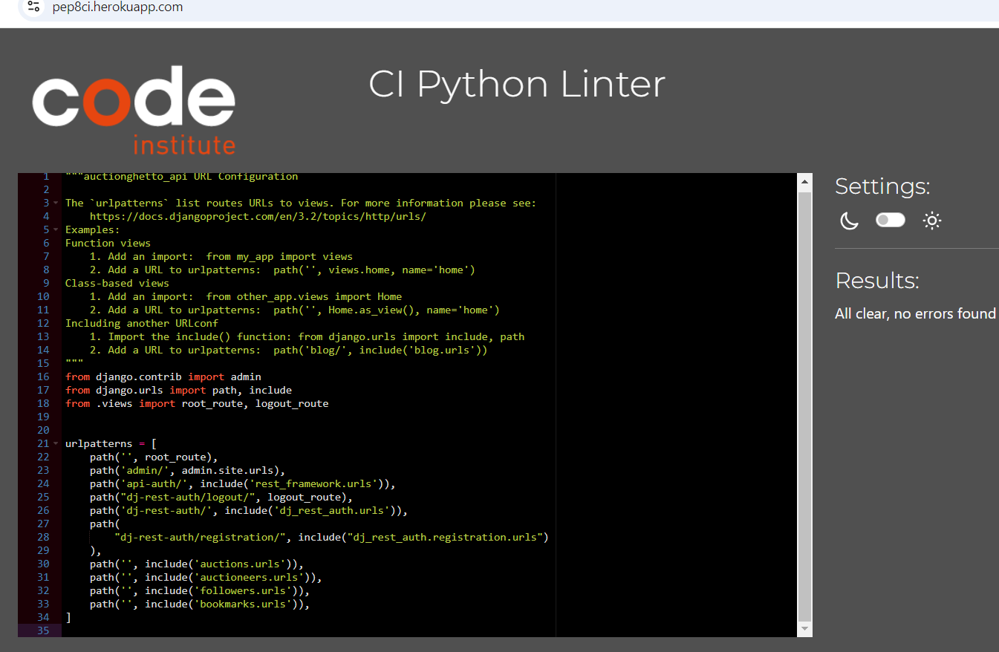

 

- Settings.py

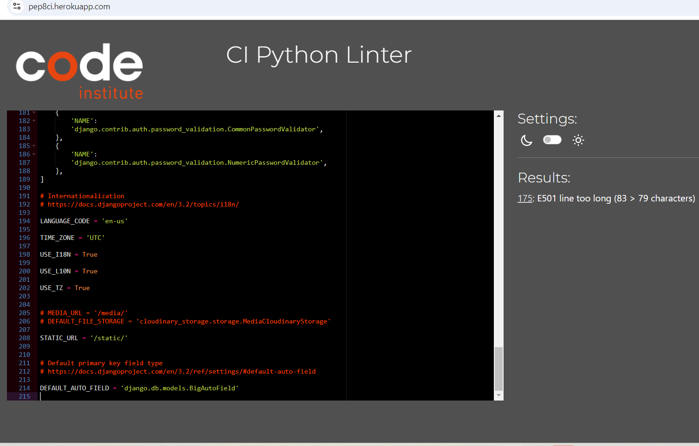 Settings.py with error

 

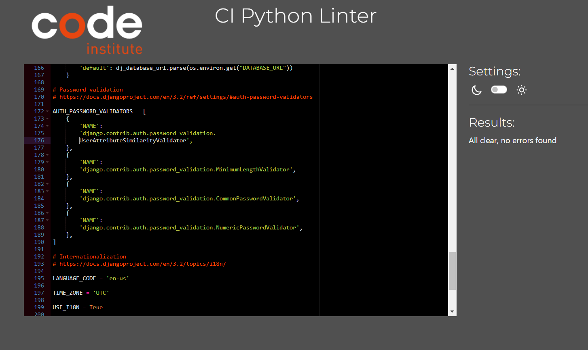 Settings.py no error

 

- Auction_models.py

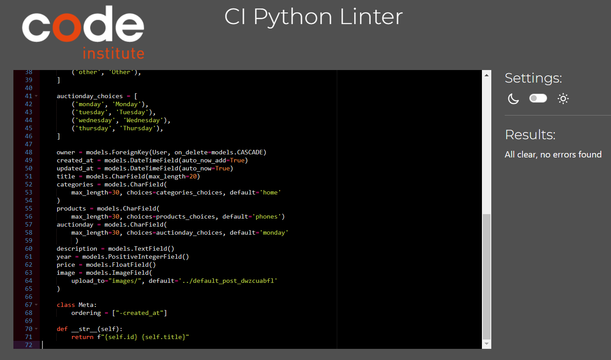

 

- Auction_serializers.py

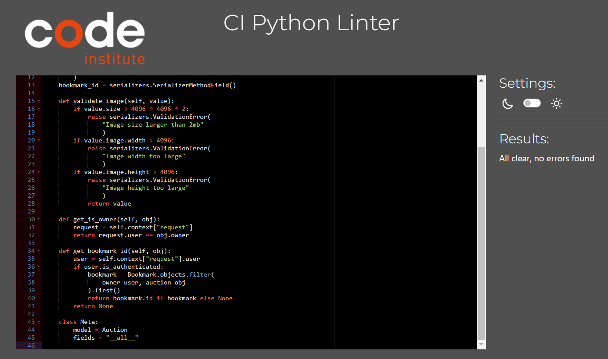

 

- Auction_views.py

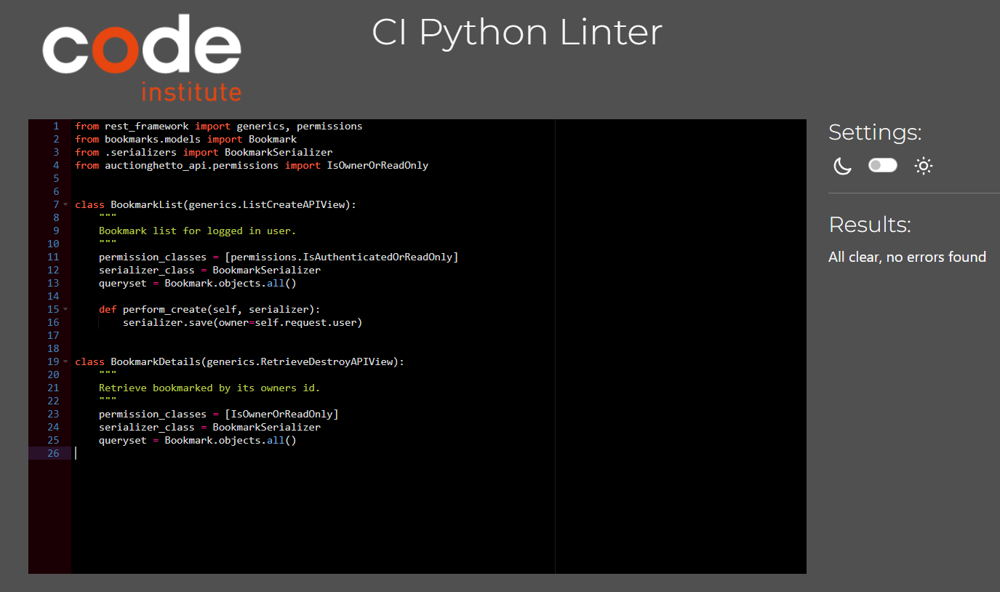

 

- Auctioneer_models.py

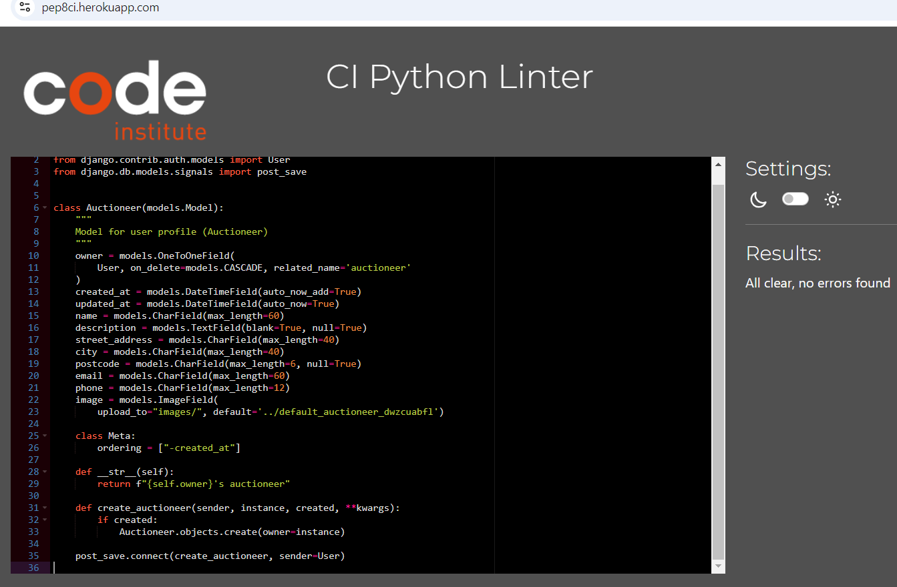

 

- Auctioneer_serializers.py

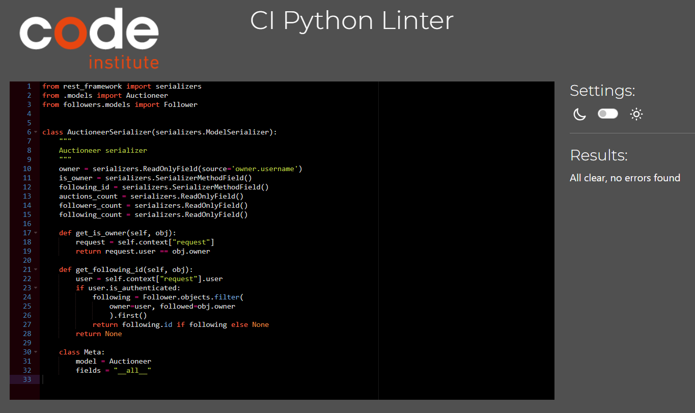

 

- Auctioneer_views.py

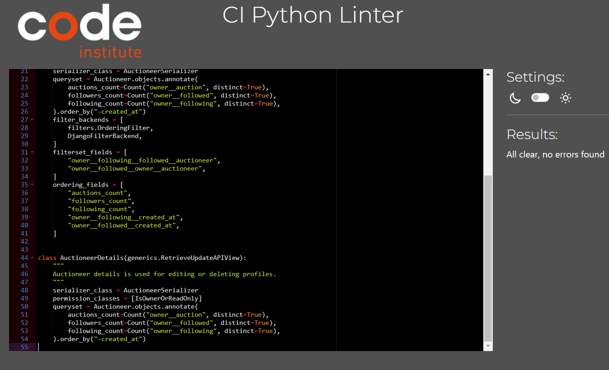

 

- Bookmark_views.py.

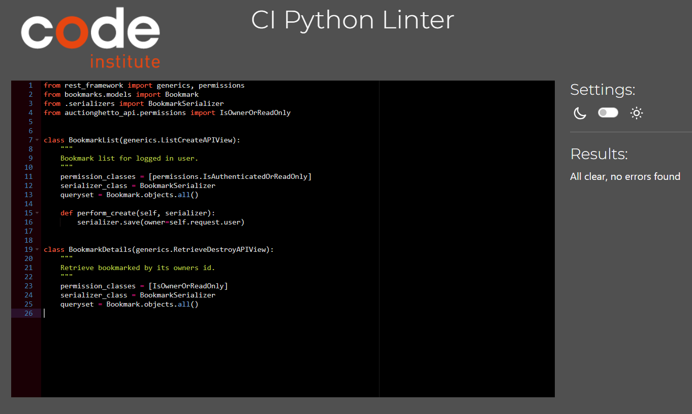

 

- Follower_serializers.py

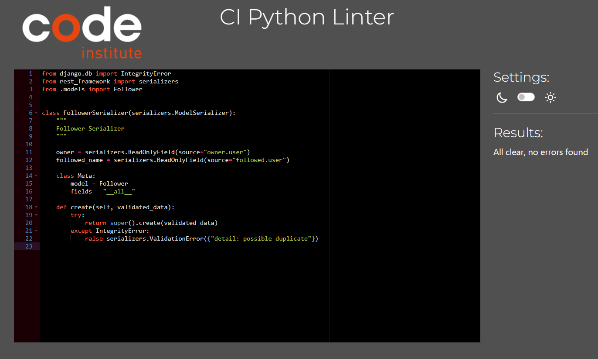

 

Return to [README.md](https://github.com/Madu-J/auctionghetto-backend/blob/main/README.md)

 

[Back to top](#top)